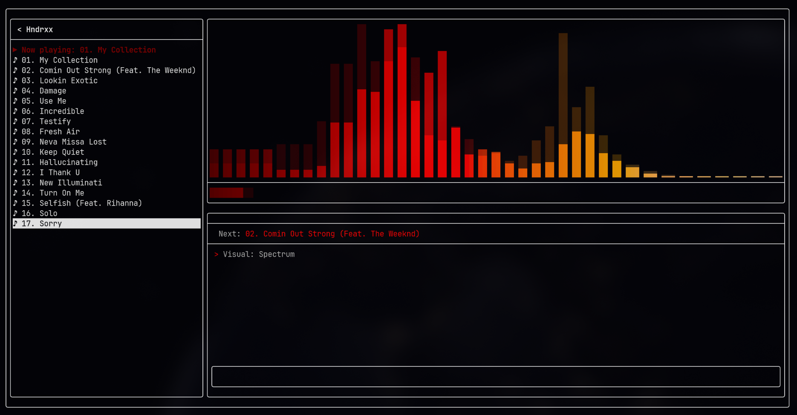
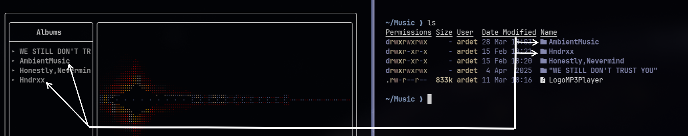
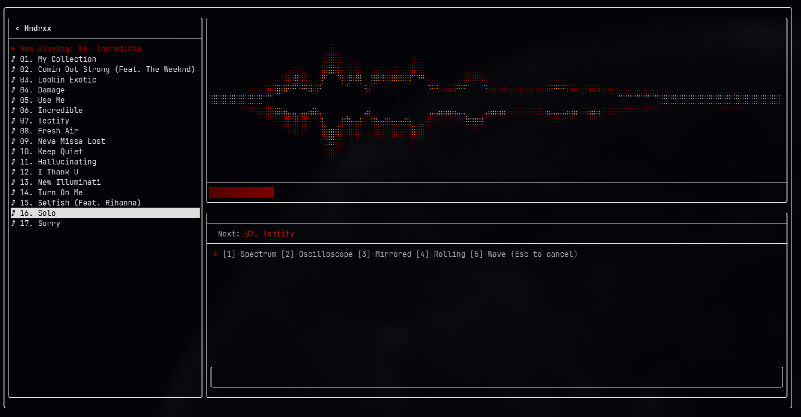
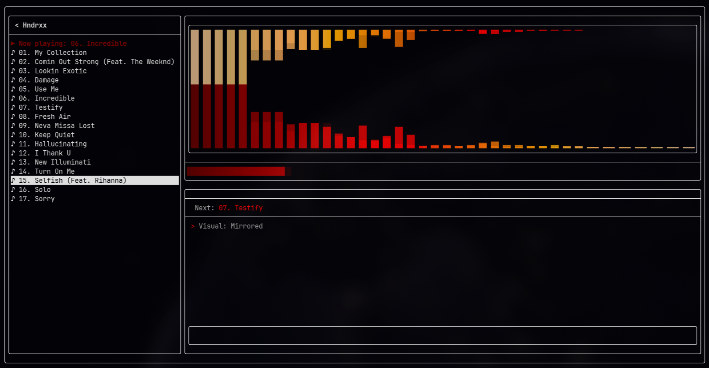
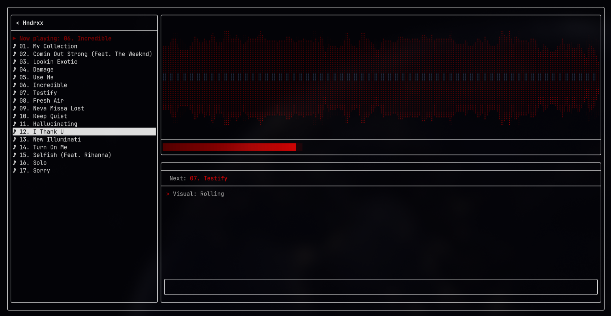
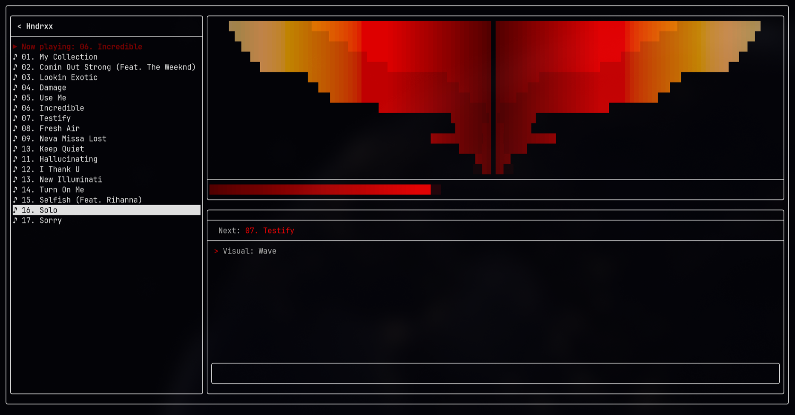
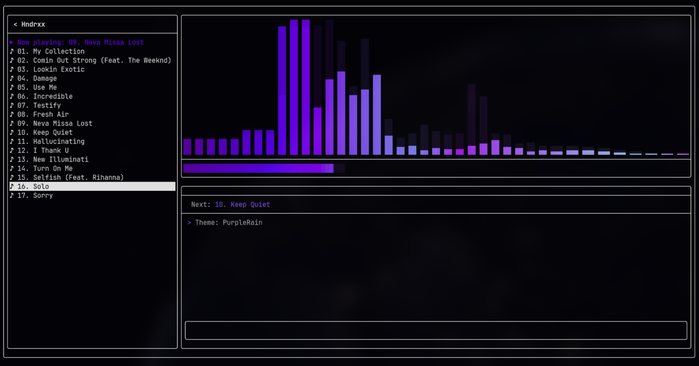
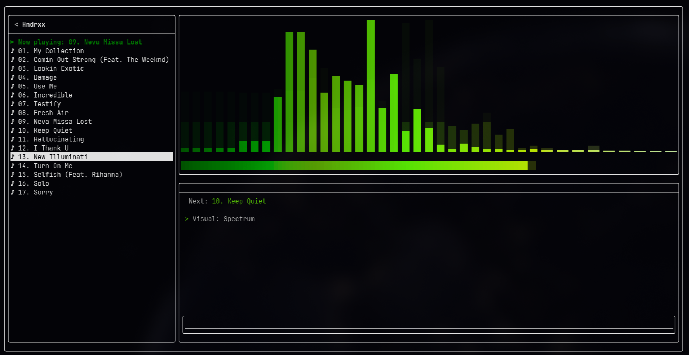
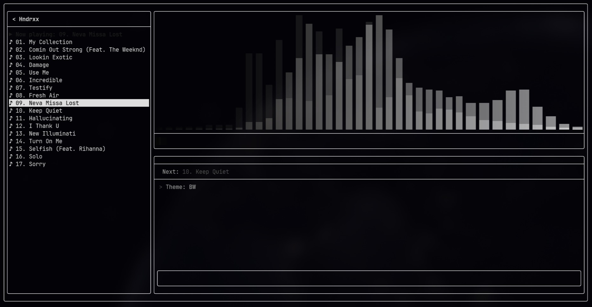
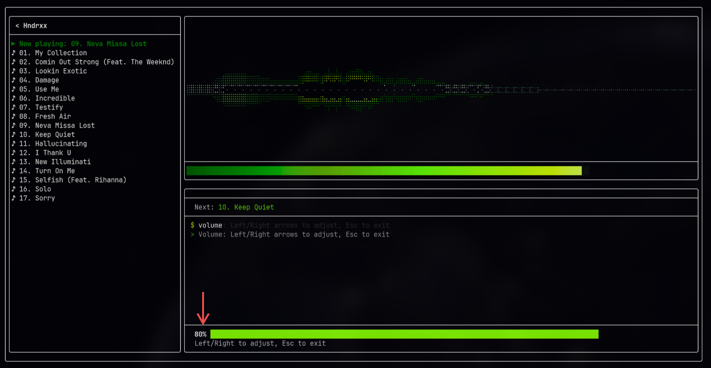

# Minimalist MP3 Player

#### Designed for great performance and low memory/cpu usage with C++20.



---

## Install

### Pre-built binaries (easiest)

Pre-built binaries for Linux (x86_64) and macOS (arm64) are available on the [GitHub Releases](https://github.com/ardet696/MinimalistMP3Player/releases) page. Download the binary for your platform, make it executable, and run. You only need SDL2 installed:

| Platform | Install SDL2 |
|----------|-------------|
| Arch | `sudo pacman -S sdl2` |
| Ubuntu / Debian | `sudo apt install libsdl2-2.0-0` |
| Fedora | `sudo dnf install SDL2` |
| macOS | `brew install sdl2` |

```bash
chmod +x mp3player-linux-x86_64
./mp3player-linux-x86_64
```

### Arch Linux (AUR) 

```bash
yay -S minimalist-mp3-player
```

### Build from source

Install dependencies:

| Distro | Command |
|--------|---------|
| Arch | `sudo pacman -S sdl2 cmake gcc` |
| Ubuntu / Debian | `sudo apt install libsdl2-dev cmake g++` |
| Fedora | `sudo dnf install SDL2-devel cmake gcc-c++` |

```bash
git clone --recursive https://github.com/ardet696/MinimalistMP3Player.git
cd MinimalistMP3Player

cmake -B build -DCMAKE_BUILD_TYPE=Release
cmake --build build -j$(nproc)

./build/MP3Player
```

> Note: Avoid using `sudo cmake --install build` if you plan to use the AUR package later, both install to different paths and the manual install takes priority.

### macOS

Apple Clang does not support std::jthread. macOS users must install GCC via Homebrew:

```bash
brew install gcc sdl2 cmake

ls /opt/homebrew/bin/g++-*  

cmake -B build -DCMAKE_BUILD_TYPE=Release -DCMAKE_CXX_COMPILER=g++-14
cmake --build build -j$(sysctl -n hw.ncpu)

./build/MP3Player
```


---

## How to use

### First launch? You have set  your music root directory.
The idea of this Player has been built around the concept of an "Album Player" or "Playlist Player".

- The code in "library/" is set to scan your "~/Music/" directory provided. 

The program will look for directories with mp3 files in the music root dir,  that can be considered as an "Album" or "Playlist".

- When the MP3Player is launched, it will show in the left side of the TUI the list of albums detected.
On first launch the file manager will be empty.

- Type RootConfig in the command bar and press Enter, then type the full path to your music directory (e.g. `/home/user/Music`) and press Enter again. 


In the following screenshot, there is in the MP3Player TUI showing the detected albums, in the right side the "ls" of that music directory.
For example the ".png" image s discarded, I do not recommend using a different structure than this for the music directory since it has been developed to follow this pattern.


Use ↑ / ↓ to scroll between albums or songs press enter to select.

### Command terminal emulator

The command panel works like a mini config-chat. 
Some commands: play, stop, next, prev, help, fileHelp.

Commands like volume, output, visuals, themes, and RootConfig enter an interactive mode that waits for your selection. Press `Esc` at any time to cancel and return to the normal command input.

### Playing Bar & Visualisations

Choose from 5 different modes:

<table>
  <tr>
    <td></td>
    <td></td>
  </tr>
  <tr>
    <td></td>
    <td></td>
  </tr>
</table>

### Settings persistence

Theme, visualisation mode, and music root path are saved to `~/.config/minimalmp3/config.txt` and restored on next launch.

### Themes
The changes of theme of the overall terminal emulator are due to my linux distribution (Omarchy). But within the TUI app you can change the colors of the different features like the playing bar or audio spectrum.
Type themes and press enter, then enter a number [1,4] to switch the colour palette:

<p align="center">
  
  
  
</p>

### Volume

Use arrows keys to decrease / increase the volume in steps of 5%. 


