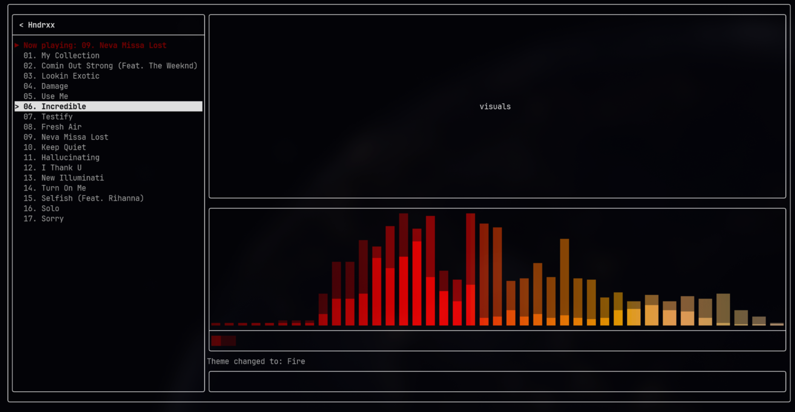
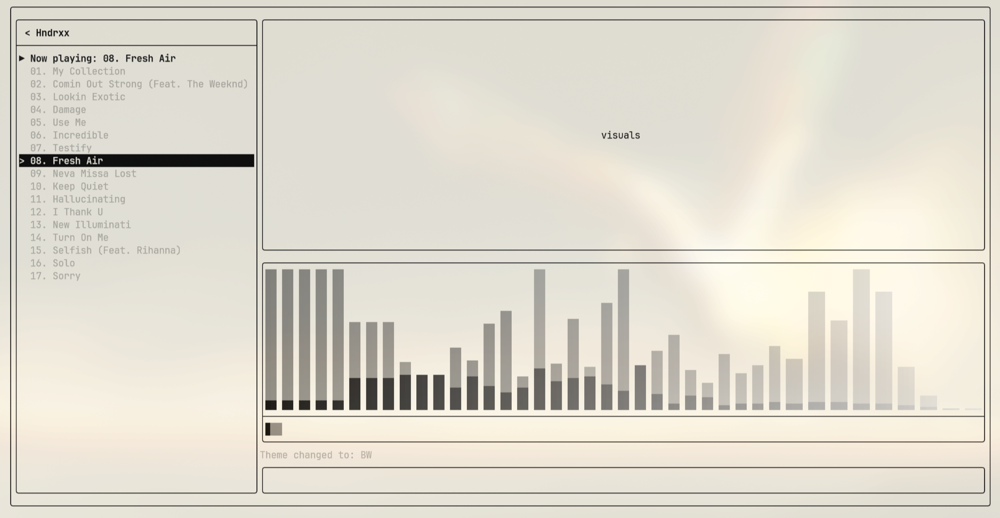
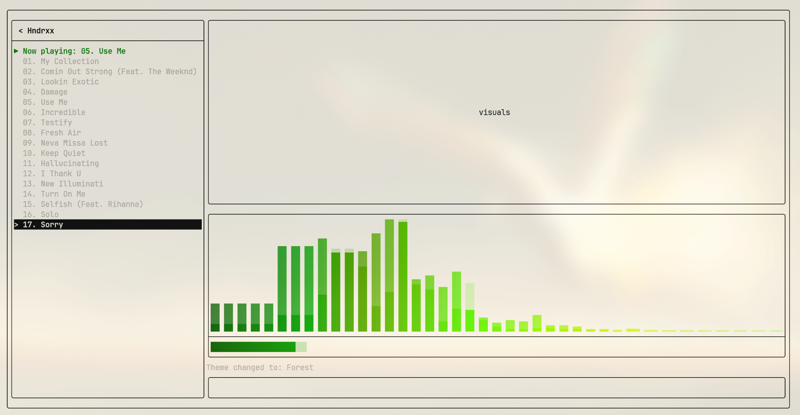
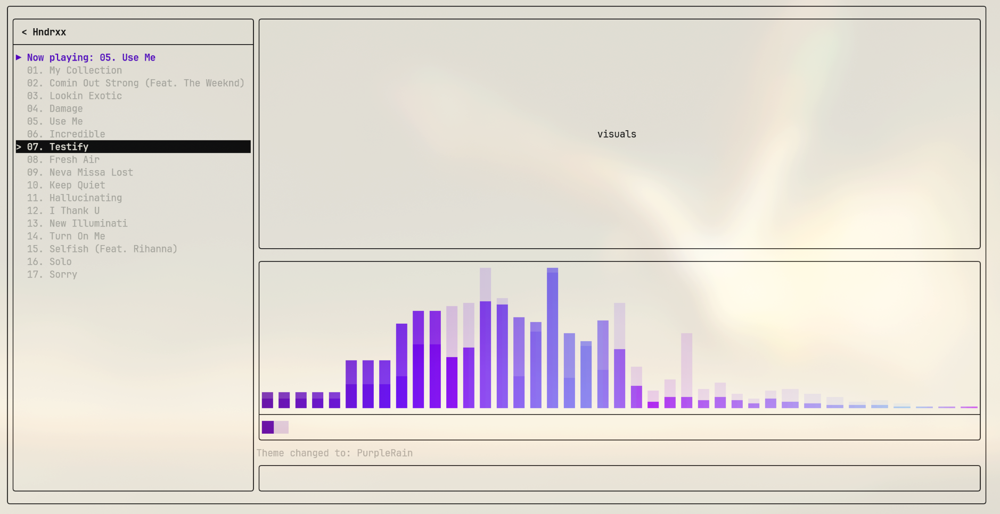

# Minimalist MP3 Player

#### Simple and minimalist MP3 player, designed for great performance and low memory/cpu usage with C++20.



---

## Build & Install

### Dependencies

- **C++20 compiler** (GCC 11+ or Clang 14+)
- **CMake** 3.20+
- **SDL2**

Install dependencies on your distro:

| Distro | Command |
|--------|---------|
| Arch | `sudo pacman -S sdl2 cmake gcc` |
| Ubuntu / Debian | `sudo apt install libsdl2-dev cmake g++` |
| Fedora | `sudo dnf install SDL2-devel cmake gcc-c++` |

### Build & install from source

Open a terminal and run the following commands one by one:

```bash
# 1. Clone the repository (includes the FTXUI dependency)
git clone --recursive https://github.com/ardet696/MinimalistMP3Player.git
cd MinimalistMP3Player

# 2. Build the release version
cmake -B build -DCMAKE_BUILD_TYPE=Release
cmake --build build -j$(nproc)

# 3. (Optional) Install system-wide so you can launch it from any terminal
sudo cmake --install build
```

After step 2, you can already run the player with `./build/MP3Player`.

After step 3, the binary is installed to `/usr/local/bin/` and you can launch it from anywhere by simply typing:

```bash
MP3Player
```

> **Note:** If you skip step 3, you will need to run `./build/MP3Player` from the project directory every time.

### Arch Linux (AUR)

A `PKGBUILD` is included in the repository. Arch users can also install from the AUR:

```bash
yay -S minimalist-mp3-player
```

### macOS

Apple Clang does not support `std::jthread` (a C++20 feature used throughout the codebase). macOS users must install GCC via Homebrew:

```bash
# 1. Install dependencies
brew install gcc sdl2 cmake

# 2. Find your GCC version
ls /opt/homebrew/bin/g++-*    # e.g. g++-14, g++-16

# 3. Build with GCC instead of Apple Clang (replace 14 with your version)
cmake -B build -DCMAKE_BUILD_TYPE=Release -DCMAKE_CXX_COMPILER=g++-14
cmake --build build -j$(sysctl -n hw.ncpu)

# 4. Run
./build/MP3Player
```

### Windows

The codebase is cross-platform (SDL2, FTXUI, and minimp3 all support Windows), but has only been tested on Linux. Contributions and testing for Windows are welcome.

---

## How to use

### First launch — set your music root

On first launch the file manager will be empty. Type `RootConfig` in the command bar and press `Enter`, then type the full path to your music directory (e.g. `/home/user/Music`) and press `Enter` again. The path is persisted across sessions. Only directories that contain `.mp3` files directly (no subdirectories) are recognised as albums.

### Album Manager (left panel)

| Key | Action |
|-----|--------|
| `↑` / `↓` | Navigate albums |
| `Enter` | Open album and start playing from track 1 |
| `↑` / `↓` (inside album) | Navigate songs |
| `Enter` (on a song) | Play selected song |
| `Backspace` | Go back to album list |

The currently playing track is highlighted in the song list with a `▶ Now playing:` indicator.

### Playback commands (command bar, bottom)

Type a command and press `Enter`:

| Command | Action |
|---------|--------|
| `play` | Resume playback |
| `stop` | Pause playback |
| `next` | Skip to next track |
| `prev` | Go back to previous track |
| `help` | Show available commands |
| `fileHelp` | Show file manager key bindings |
| `output` | Select audio output device |
| `RootConfig` | Change the music root directory |
| `themes` | Enter theme selection mode |
| `quit` / `q` | Exit the player |

### Playing Bar

At the bottom of the right panel sits the playing bar. It has two layers:
- **Spectrum visualiser** — 40 log-scaled bars driven by a real-time FFT, animated at 30 fps. Bar decay speed is driven by BPM detection so the animation breathes with the music.
- **Progress bar** — a thin gauge underneath the spectrum showing playback position.

### Themes

Type `themes` and press `Enter`, then enter a number `1`–`4` to switch the colour palette of the spectrum and progress bar instantly:

| # | Theme |
|---|-------|
| 1 | Fire |
| 2 | BW |
| 3 | PurpleRain |
| 4 | Forest |

The palette applies to whatever terminal colour scheme you are running. Below are examples taken from different [Omarchy](https://omarchy.org) themes:





### Pre-built binaries

Pre-built binaries for Linux (x86_64) and macOS (arm64) are available on the [GitHub Releases](https://github.com/ardet696/MinimalistMP3Player/releases) page. Download the binary for your platform, make it executable, and run — no compiler needed. You still need SDL2 installed as a runtime dependency:

| Platform | Install SDL2 |
|----------|-------------|
| Ubuntu / Debian | `sudo apt install libsdl2-2.0-0` |
| Fedora | `sudo dnf install SDL2` |
| macOS | `brew install sdl2` |

```bash
chmod +x mp3player-linux-x86_64
./mp3player-linux-x86_64
```

---

## CI/CD

Releases are fully automated via GitHub Actions. When a version tag is pushed:

```bash
git tag v1.0.1
git push --tags
```

The pipeline will:
1. **Build** Linux (x86_64) and macOS (arm64) binaries
2. **Create a GitHub Release** with both binaries attached and auto-generated release notes
3. **Update the AUR package** (`minimalist-mp3-player`) to the new version automatically

The workflow is defined in [`.github/workflows/release.yml`](.github/workflows/release.yml).

---

## Technical

### Audio pipeline

```
MP3 File → Mp3Decoder → DecodeThread → RingBuffer → SDL Audio Callback → SdlAudioSink → Speakers
```

### Visualisation pipeline

```
SDL Audio Callback → SpectrumAnalyzer.feed()  → mutex  → PlayingBar (40 log-scaled bars)
                   → BpmDetector.feed()        → atomic → PlayingBar (bar decay speed)
```

### Threads

The player runs 11 threads in steady state:

- **Main / TUI thread** — runs the FTXUI event loop and renders at ~30 fps.
- **Refresh thread** — posts a custom FTXUI event every 33 ms to trigger redraws independent of user input.
- **Directory watcher thread** — polls the music root directory every 2 seconds. If folders are added or removed, it rescans the library and triggers a file manager refresh automatically.
- **Decode thread** — continuously reads compressed MP3 frames via minimp3, decodes them into raw PCM `int16_t` samples, and writes them into the ring buffer. Managed by `std::jthread` with cooperative cancellation via `std::stop_token` — no `terminate()` calls, no detached threads.
- **SDL audio callback thread** — spawned internally by SDL2. Fires on a real-time schedule to pull frames from the ring buffer and push them to the hardware. This thread must never block.
- **Auto-advance monitor thread** — polls `PlaybackEngine::hasReachedEndOfStream()` and triggers the next track automatically when the SDL callback has drained the ring buffer after the decode thread signals end-of-stream.
- **Pre-warm / song-load threads** — when a song switch occurs, the next file is opened and buffered on a background thread while the current track is still playing. By the time the audio callback needs the first frame of the new track the decoder and ring buffer are already warm, so there is no audible gap or stutter between tracks.

All background threads are owned by RAII wrappers. `std::jthread` automatically requests a stop and joins on destruction, so no thread can outlive the object that owns it.

### Lock-free audio path

The ring buffer between the decode thread and the SDL callback is a single-producer single-consumer (SPSC) design using `std::atomic` head and tail indices. The audio callback thread never takes a mutex — a lock on the real-time path would cause the OS scheduler to potentially delay the callback, producing audible glitches. The decode thread sleeps when the buffer is full; the callback never waits.

### RAII resource management

Every resource in the audio pipeline is tied to an object lifetime:

- `Mp3Decoder` wraps the minimp3 handle behind the **Pimpl idiom** (`std::unique_ptr<Impl>`) — the minimp3 state is heap-allocated and freed in the destructor, keeping the header clean and the ABI stable.
- `SdlAudioSink` calls `SDL_CloseAudioDevice` in its destructor. The SDL audio subsystem is never left open.
- `DecodeThread` calls `jthread::request_stop()` and joins in its destructor.
- `AutoAdvanceManager` stops and joins its monitor thread in its destructor.
- `PlaybackEngine` holds all pipeline components as `std::unique_ptr` members — teardown order is deterministic and the destructor is trivial.

No raw `new` / `delete` anywhere in the codebase.

### BPM detection

The audio callback feeds every decoded chunk into `BpmDetector`. The signal is mono-mixed, low-pass filtered with a single-pole IIR (cutoff 150 Hz), downsampled to ~500 Hz, then windowed into 50 ms energy frames. When a frame's energy exceeds 1.5× the local average it is flagged as an onset. Inter-onset intervals over the last 8 beats are averaged to produce a BPM estimate, which is mapped to a `loadFactor` in [0, 1] via `clamp((bpm − 60) / 120)`. This value crosses the thread boundary as a `std::atomic<float>` (single primitive — no mutex needed) and drives the exponential decay rate of the spectrum bars.

### Performance (measured on Arch Linux, Intel i7, 32 GB RAM)

| Metric | Value |
|--------|-------|
| RSS memory (steady state) | ~23 MB |
| Peak memory | ~23 MB |
| CPU usage during playback | ~2–3% (1 core of 16) |
| Memory growth over session | None (0 major faults) |
| Threads | 11 |

Memory stays flat throughout a session — no leaks from the ring buffer, spectrum allocations, or FTXUI re-renders. For reference, Spotify idles at ~300 MB and mpv at ~50–80 MB.
